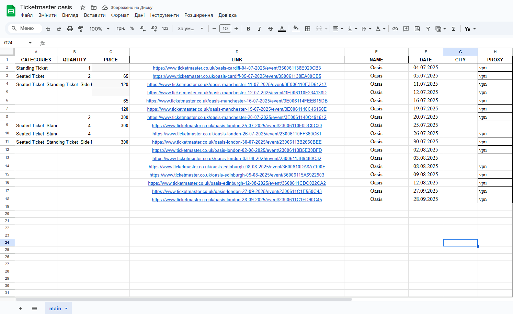
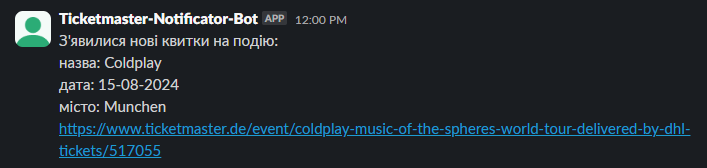

track availability of tickets for events from ticketmaster.co.uk, ticketmaster.eu and ticketmaster.ae and sends info to slack.

# How it works
1. it opens up chrome instance browser
2. changes proxy or vpn's country
3. opens up configurated with query params link from spreadsheets
4. checks the event for tickets availability
5. if tickets are available and its under our filters from spreadsheets configuration, response with message to slack
6. if there are no tickets available on any event, loop over every link again after 10 min. 

# Requirements

- Running Google Chrome Instance
- Google Sheets
- Python 3
- Proxy (optional)

# Get Started

1. install requirements ```pip install -r requirements.txt``` or [install.bat](install.bat)
2. setup you Google Sheets following the example in [Spreadsheets Configuration](#spreadsheets-configuration)
3. run bot with ```python -m main.py``` [run.bat](run.bat)

# Ticketmaster API

API to retrieve  list of available tickets of an event

## Endpoint

/api/quickpicks/<EVENT_ID>/list

## URL Parameters

|Name|Value|Description|
|----|-----|-----------|
|EVENT_ID|23006130DAB40C0B|ID of  Event|

### How to get Event ID

1. search for Event on ticketmaster.co.uk (e.g. [https://www.ticketmaster.co.uk/coldplay-tickets/artist/806431](https://www.ticketmaster.co.uk/coldplay-tickets/artist/806431))
2. go to Ticket Site (e.g. [https://www.ticketmaster.co.uk/coldplay-music-of-the-spheres-world-london-22-08-2025/event/23006130DAB40C0B](https://www.ticketmaster.co.uk/coldplay-music-of-the-spheres-world-london-22-08-2025/event/23006130DAB40C0B))
3. get Event ID (e.g. 23006130DAB40C0B) from URL

## GET Parameters

|Name|Value|Description|
|----|-----|-----------|
|resale|true|if true, only resale tickets will be returned|
|qty|1|number of tickets you're looking for|
|offset|0|position from where to start returning results|
|limit|100|number of maxium returned results|
|sort|price|attribute to sort results|
|primary|true|n/a|
|defaultToOne|true|n/a|
|tids|000000000004|n/a|

## Cookies

### Required

|Name|Domain|
|----|------|
|BID|.ticketmaster.co.uk|
|eps_sid|.ticketmaster.co.uk|
|language|.ticketmaster.co.uk|
|reese84|.ticketmaster.co.uk|

### Others

|Name|Domain|
|----|------|
|Queue-it|queue.ticketmaster.co.uk|
|cf_clearance|.help.ticketmaster.co.uk|
|ma.did|.identity.ticketmaster.co.uk|

## Response

### HTTP Status Codes

|Status|Descripton|How Bot handles it|
|------|----------|----------------------|
|200|Request successful|checks for tickets availablity|
|403|Forbidden|changes proxy or vpn's country and moves on to the next event|
|404|Event not found|sends message to slack about incorrect configuration in spreadsheets|
|503|Event temporarily not available|skips this event|

### Body when no Ticket is available

```
{
	"quantity": 0,
	"total": 0,
	"picks": [],
	"descriptions": []
}
```

### Body when 1 Ticket is available

```
{
	"quantity": 1,
	"eventId": "23006113B5E30BFD",
	"total": 1,
	"picks": [
		{
			"id": "lg899kjn6",
			"type": "general-seating",
			"section": "PITCH",
			"originalPrice": 396.93,
			"description": "",
			"areaName": "",
			"placeDescriptionId": "IE5DCNJMHE",
			"hasSpecialDescription": false,
			"offerIds": [
				"HF6GYZZYHE4WW2TOGY"
			],
			"snapshotImageUrl": "image?systemId=HOST_UK&segmentIds=s_168",
			"quality": 0.97235,
			"sellerBusinessType": "private",
			"resaleListingId": "lg899kjn6",
			"sellerAffiliationType": "unaffiliated",
			"attributes": []
		}
	],
	"descriptions": [
		{
			"id": "IE5DCNJMHE",
			"descriptions": [
				"No U14s. Under 18s with adult 18+",
				"Incl. 2.75 Facility Fee"
			]
		}
	]
}
```

## Subdomains

- www.ticketmaster.co.uk
- queue.ticketmaster.eu
- identity.ticketmaster.ae
- help.ticketmaster.eu


# Ticketmaster API v2

API to retrieve  list of available tickets of an event

## Endpoint and domain

availability.ticketmaster.<REGION_CODE>/api/v2/TM_<COUNTRY_CODE>/availability/<EVENT_ID>

## URL Parameters

|Name|Value|Description|
|----|-----|-----------|
|EVENT_ID|1303373|ID of  Event, consists of digits|
|COUNTRY_CODE|fr, de, es..., in lowercase|country code of Event|
|REGION_CODE|EU, AE..., in uppercase|region code of Event|

## Body when no Ticket is available

```
{
  "groups": [
    
  ],
  "offers": [
    
  ]
}
```

### Body when 1 Ticket is available
```
{ 
    "groups": [
        {
            "offerIds": [
            "KB6DCORS",
            "KB6DEORS"
                ],
            "places": {
                "FL-P2": {
                "12": [
                    "3",
                    "8"
                ],
                "13": [
                    "1",
                    "2",
                    "5",
                    "20",
                    "35"
                ],
                },
            },
            "generalAdmission": false
        }
    
    ],
   "offers": [
        {
        "id": "KB6DCORS",
        "priceLevel": 2,
        "priceType": 1,
        "type": "standard"
        }
    ]
}
```

## Subdomains

- www.ticketmaster.co.uk
- availability.ticketmaster.pl
- queue.ticketmaster.eu
- identity.ticketmaster.ae
- help.ticketmaster.eu

# Error logs

all exceptions and errors are written in exception_log.txt


# Spreadsheets Configuration

create google sheets with following attributes:

|Name|Description|Available Values|Required|
|----|-----------|----------------|--------|
|CATEGORIES|Desired categories name divided by "  " (double space) that wil be used as a whitelist |String: "Standing Ticket, Side Possible Limited"|No|
|QUANTITY|Entered amount will be used in query parameter &qty=<Quantity>|Int: 5|No|
|PRICE|Soring tickets by max price and represents query param &max=<Price>, if empty &sort=price|Int: 599|No|
|LINK|Ticketmaster's event link|https://www.ticketmaster.co.uk/coldplay-music-of-the-spheres-world-london-30-08-2025/event/23006130DDEE0C19|Yes|
|NAME|Name of event used to be sent in slack as additional information|String: "Oasis"|No|
|DATE|Date of event used to be sent in slack as additional information|Date: 04.07.2026|No|
|CITY|City of event used to be sent in slack as additional information|rincipality Stadium, Cardiff|No|
|PROXY|Used to connect selenium browser to proxy or vpn VeePN|String: "host:port:login:password", String: "vpn"|No|

## Google Sheets configuration sample


# Slack message sample



# Testing

## Scripts

[curl.bat](testing/curl.bat) - basic cURL command of sample request from Chrome Dev Tools

[request_session.py](testing/request_session.py) - simple Python request sample with hardcoded headers and cookies

# Ticketmaster Troubleshooting

|Error|Reason|Solution|
|-----|------|--------|
|Let's Get Your Identity Verified|malicious browsing behavior|resolve captcha|
|Your Session Has Been Suspended|too many requests|automatically unsupended by ticketmaster in a range from 1 min to 30 days or after proxy/vpn switch|
|Pardon the Interruption|same as Your Session Has Been Suspened but with captcha reuired|sometimes dissapear after captcha resolve. Dissapear after proxy/vpn switch. Dissapear in a duration from 1 min to 30 days|
